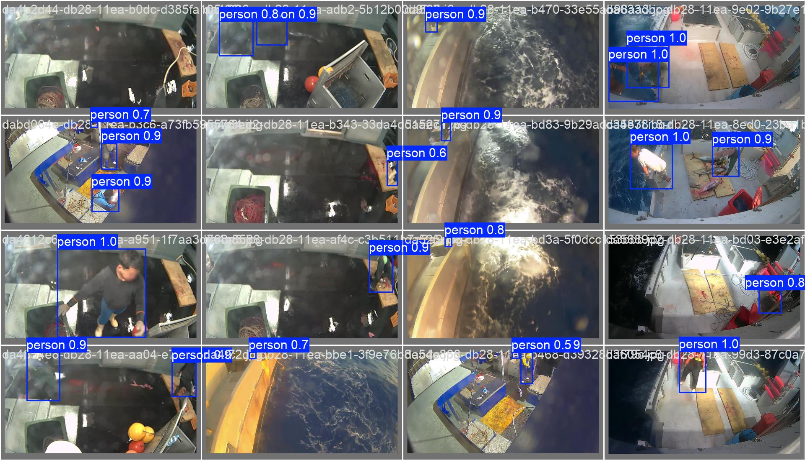

<h1 align="center">Development of a Two-Step Artificial Intelligence System
for the Detection and Classification of Recreational Fishing</h1>

 
   
   
   
   
   

A two-step computer vision system designed to automatically detect and classify recreational fishing activities on beaches and coastal areas.
The system improves monitoring accuracy by separating person detection and fisher classification into two dedicated deep learning models.

<h2>Development</h2>

<h3>1. Person Detection Model (YOLOv11-L) - Detection</h3>

<h4><i>Manual hyperparameter search</i></h4>

A total of <strong>7 custom configurations</strong> were manually designed and tested, varying:

<ul>
  <li>Learning rate</li>
  <li>Optimizer (AUTO vs SGD)</li>
  <li>Momentum</li>
  <li>Distribution Focal Loss (DFL)</li>
  <li>Image size and batch size</li>
</ul>

Each configuration was trained for 50 epochs on Google Colab, using early stopping to compare performance.

<h4><i>Training with best configuration</i></h4>

The configuration <code>config3_lr_basso</code> showed the best detection metrics (<strong>mAP50, Recall, Precision</strong>) and was selected for full training.

<h4><i>Testing</i></h4>

The model was evaluated on the Mix Detection test set, achieving the following results:

<ul>
  <li><strong>mAP50:</strong> 0.561</li>
  <li><strong>mAP50-95:</strong> 0.301</li>
  <li><strong>Precision:</strong> 0.701</li>
  <li><strong>Recall:</strong> 0.498</li>
</ul>

<h3>2. Person–Fisher Classification Model (YOLOv11-Classify) - Classification</h3>

<h4><i>Automated hyperparameter tuning</i></h4>

The <strong>YOLO tune</strong> method was used for automatic hyperparameter optimization.

<h4><i>Training with optimal parameters</i></h4>

The classification model was trained using the best configuration identified by the automated tuning.

<h4><i>Testing</i></h4>

The model was evaluated on the Mix Classification test set, achieving the following results:

<ul>
  <li><strong>Top-1 accuracy:</strong> 99.16%</li>
  <li><strong>Inference Time:</strong> 412 ms</li>
</ul>

<h2>Tech Stack</h2>
<ul>
  <li>Python 3.12</li>
  <li>Ultralytics YOLOv11</li>
  <li>PyTorch</li>
  <li>Google Colab (A100/T4 GPUs)</li>
</ul>

<h2>Documentation</h2>

Full technical documentation available here: 
<a href="/docs/Tesi_Michele_Vigliotta.pdf"><code>Tesi_Michele_Vigliotta.pdf</code></a>

<h2>Authors</h2>

* Michele Vigliotta

<i>University project developed as part of the thesis work.</i>

