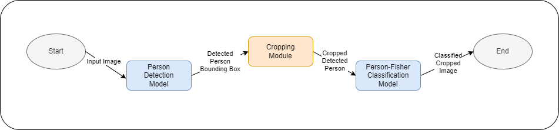

<h1 align="center">Development of a Two-Step Artificial Intelligence System
for the Detection and Classification of Recreational Fishing</h1>

 
   
   
   
   
   

This is a two-step computer vision system designed to automatically detect and classify recreational fishing activities on beaches and coastal areas.
The system improves monitoring accuracy by separating person detection and fisher classification into two dedicated deep learning models.

<h2>Development</h2>

<h3>1. Person Detection Model (YOLOv11-L) - Detection</h3>

<h4>Manual hyperparameter search</h4>

A total of <strong>7 custom configurations</strong> were manually designed and tested, varying:

<ul>
  <li>Learning rate</li>
  <li>Optimizer (AUTO vs SGD)</li>
  <li>Momentum</li>
  <li>Distribution Focal Loss (DFL)</li>
  <li>Image size and batch size</li>
</ul>

Each configuration was trained for 50 epochs on Google Colab, using early stopping to compare performance.

<h4><u>Training with best configuration</u></h4>

The configuration with the best detection metrics (<strong>mAP50, Recall, Precision</strong>) — the low learning rate setup — was selected for full training.

<h4><u>Testing<u></h4>

The model was evaluated on the Mix Detection test set to validate generalization to unseen aerial scenes.

<h3>2. Person–Fisher Classification Model (YOLOv11-Classify)</h3>

<h4>• Automated hyperparameter tuning</h4>

The <strong>YOLO tune</strong> method was used for automatic hyperparameter optimization, searching across:

<ul>
  <li>Learning rate values</li>
  <li>Optimizers</li>
  <li>Augmentation strategies</li>
  <li>Scheduling patterns</li>
</ul>

<h4>• Training with optimal parameters</h4>

The classification model was trained using the best configuration identified by the automated tuning.

<h4>• Testing</h4>

The final model was tested on the Mix Classification test set to verify its ability to correctly distinguish fishers from non-fishers.

<h2>🧠 Tech Stack</h2>
<ul>
  <li>Python 3.12</li>
  <li>Ultralytics YOLOv11</li>
  <li>PyTorch</li>
  <li>Google Colab (A100/T4 GPUs)</li>
  <li>VS Code</li>
</ul>

<h2>📁 Project Structure</h2>

<pre>
/
├── detection/          # YOLOv11 detection model + configs
├── classification/     # YOLOv11 classify model + configs
├── utils/              # Cropping and preprocessing scripts
├── datasets/           # Custom datasets (not included)
└── inference/          # Scripts for image/video testing
</pre>

<h2>▶️ Usage</h2>

<h4>1. Run person detection</h4>
<pre><code>yolo detect predict model=path/to/detection.pt source=path/to/images
</code></pre>

<h4>2. Crop detected persons</h4>

(using the script in <code>utils/</code>)

<h4>3. Run fisher classification</h4>
<pre><code>yolo classify predict model=path/to/classification.pt source=crops/
</code></pre>

<h2>📄 License</h2>

MIT License.

